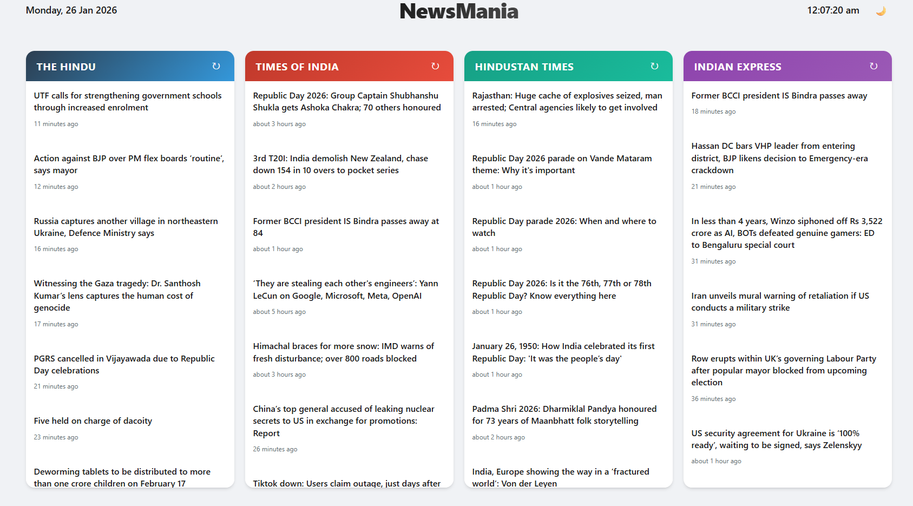

# NewsMania
A real time news dashboard that aggregate major headlines from India's top newspapers into a clean single-screen interface.

## Features
* **Live Aggregation** : Simultanouesly fetches from *The Hindu*, *Time of India*, *Hindustan Times* and *Indian Express* usig RSS feed
*  **Dark Mode**: Fully supported dark theme.
* **Time awareness**: Real-time clock and date display localized to 'en-IN'.
* **Read State Tracking**: Visually dims article you have already visited.

## Tech Stack
* **Frontend**: React(Vite), CSS.
* **Backend**: Node.js, Express.js, 'rss-parser'.
* **Database**: MongoDB(With fallback mechanism).

## Screenshots



---
## How to Run
You need to run the **Backend** and **Frontend** in seperate terminals.
### 1. Start Backend
```bash
cd server
npm install
npm rundev
# Ensure you have set up .env file as per .env.example file
```
*Sever runs on :`Server running on port 5000`*
### 2. Start Frontend
```bash
cd client
npm install
npm run dev
```
*App runs on : `http://localhost:5173`*

## Future improvements (In mind)
1. [ ] Add Authentication.
2. [ ] Take notes.
